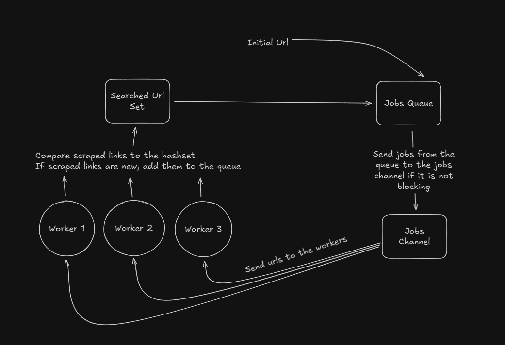

# Web-Crawler-GO

## Web cralwer

A single and multithreaded webcrawler that takes in an initial url and an array of keywords, and searches for other links on the page with matching keywords. The crawler then searches
matching links with BFS until certain terminating conditions are met.  

There are two different scrapers:

1. **Single Thread Web Crawler :** Processes pages one at a time. Processes 100 pages (2500 tokens per page) in ~25 seconds
2. **Parallel Web Crawler:** Processes pages in parallel. Process 100 pages (2500 tokens per page) in ~1.5 seconds

## How it works

### Diagram of how the Web Crawler works

### High level diagram of how the Parallel Web Crawler works

#### How and Why I designed the parallel web crawler the way I did:

I wanted to be able to process multiple pages simultaneously, which is where I decided between two different ways of parallelism.

1. I could create a goroutine for every page
2. I could create a set number of goroutines (workers)

I decided on the latter, as making a separate goroutine for every page can be expensive as the number of goroutines will grow exponentially.
Along with a set number of goroutines, I also used a buffer channel, that way I could use it like a queue but with the advantages of a channel.
I originally set up the program so that the workers would send and receive new urls to the jobs channel. This caused a deadlock as once the channel reached its maximum
capacity, the workers would block as there was no worker receiving from the channel.
I solved this issue by implementing a classic queue structure.
Workers would only send new URLs to the queue, this prevented the deadlock caused by the workers sending and receiving to the same channel.
The queue would then populate the channel by dequeing a URL and sending it to the job channel when the job channel was not blocked.
Workers would then receive new URls to parse by receiving from the channel.

#### Packages used

1. net/http - fetch pages
2. golang.org/x/net/html - parse html
3. sync - concurrency
4. HashSet - For O(1) look ups
5. Queue - Data structure used for Breadth-First Search

### Why I built this and what I learned

I built this project because I was previously only building fullstack webapps, which was starting to get a bit repetitive.
So I decided to build this simple project to get my foot into backend/systems.  

I chose to build the project in GO as I found the its goroutines to be an easy way to start building programs that require concurrency.
It is also lightweight for crawling, as I was able to build the project with simple packages without the requirement of anything heavy like Colly.
Building it with lightweight packages allowed me to understand more of smaller components of crawling. Because of its simplicity, I can also scale it in the future quite easily.  

The crawler uses the Breadth-First Search algorithm, that way links that are "closer" to the initial link are searched first. After I'd like to try out different search algorithms, such as combining BFS with DFS, changing algorithm based on certain conditions.  

I will also implement a database to store the scraped links.   

### Things I want to add:

- Use the worker pool pattern to be able to process multple Urls simultaneousely - Added
- Feed the data into an inverted index db in mongo
- Add a more refined version of keyword matching
- Be able to parse for specific information from a page
