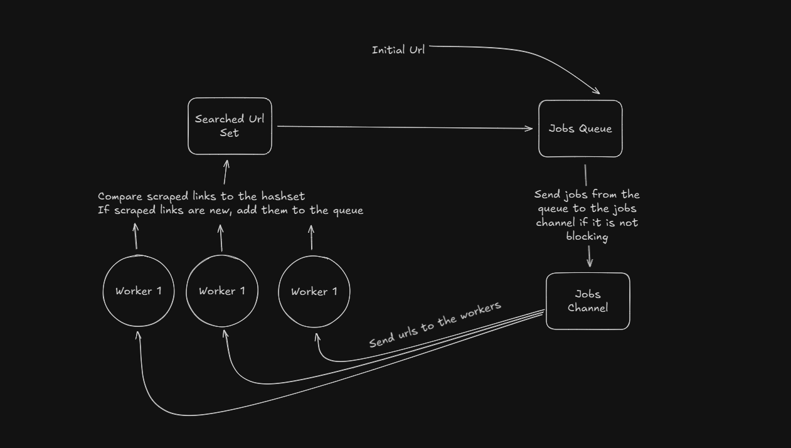

# Web-Crawler-GO

## Web cralwer

A webscrawler that takes in an initial url and and array of keywords, and searches for other links on the page with matching keywords. The crawler then searches
matching links with BFS until certain end conditions are met.  

There are two different scrapers:

1. **Single Thread Web Crawler :** Processes pages one at a time. Processes 100 pages (2500 tokens per page) in ~25 seconds
2. **Parallel Web Crawler:** Processes pages in parallel. Process 100 pages (2500 tokens per page) in ~1.5 seconds

## How it works

### Diagram of how the Web Crawler works

### High level diagram of how the Parallel Web Crawler works

1. net/http - fetch pages
2. golang.org/x/net/html - parse html
3. sync - concurrency

### Why I built this and what I learned

I built this project because I was previously only building fullstack webapps, which was starting to get a bit repetitive.
So I decided to build this simple project to get my foot into backend/systems.  

I chose to build the project in GO as I found the its goroutines to be a an easy way to start building programs that require concurrency.
It is also lightweight for crawling, as I was able to build the project with simple packages without the requirement of anything heavy like Colly.
Building it with lightweight packages allowed me to understand more of smaller components of crawling. Because of its simplicity, I can also scale it in the future quite easily.  

The crawler uses the Breadth-First Search algorithm, that way links that are "closer" to the initial link are searched first. After I'd like to try out different search algorithms, such as combining BFS with DFS, changing algorithm based on certain conditions.  

I also will implement a database to store the scraped links.   

### Things I want to add:

- Use the worker pool pattern to be able to process multple Urls simultaneousely
- Feed the data into an inverted index db in mongo
- Add a more refined version of keyword matching
